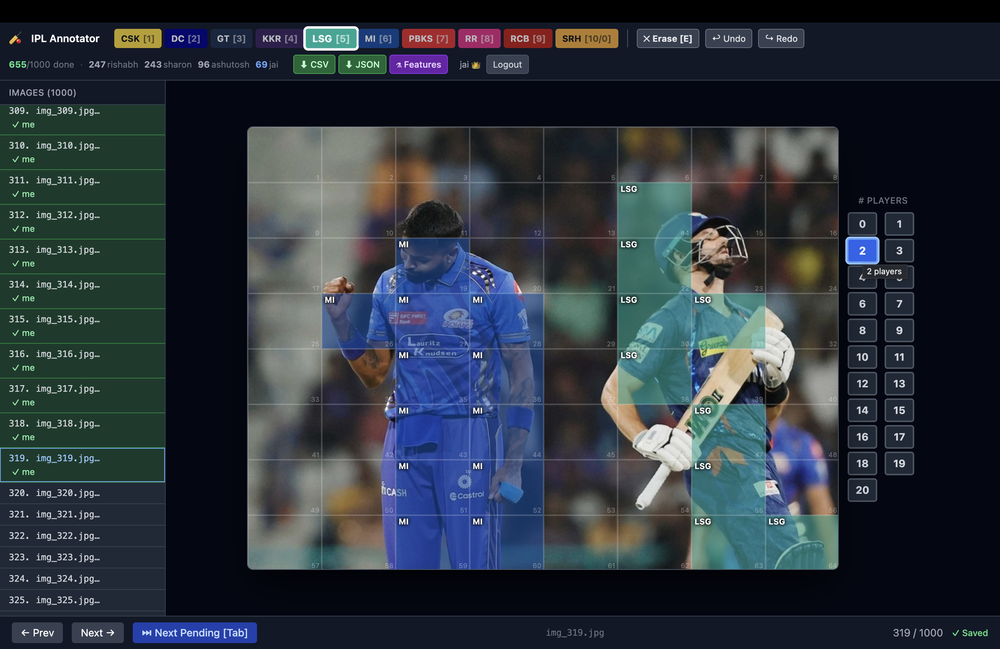

# Dataset Overview — IITB Python for ML Sem1 IPL Image Dataset

## Summary

| Property | Value |
|---|---|
| Total images | 1005 |
| Format | JPEG |
| Dimensions | 800 × 600 px (uniform) |
| Size | ~148 MB |
| Task | Grid-level team classification + player count |
| Labels per image | 64 (8×8 grid, one label per cell) + 1 player count |
| Label range | 0–10 (0 = empty, 1–10 = IPL teams) |

---

## Image Groups

| Range | Type | Count |
|---|---|---|
| `img_1` – `img_250` | IPL game broadcast images (batch 1) | 250 |
| `img_251` – `img_287` | No-player images (crowd / scoreboard / venue wide-shots) | 37 |
| `img_288` – `img_1005` | IPL game broadcast images (batch 2) | 718 |

The no-player images were originally prefixed `np_`. They were inserted at indices 251–287 during the rename so their range stays identifiable.

---

## Train / Test Split

| Split | Folder | Count | % |
|---|---|---|---|
| Train | `train/` | 793 | 78.9% |
| Test | `test/` | 212 | 21.1% |

The split was assigned before annotation and is fixed. The 37 no-player images are distributed across both splits.

---

## Grid Layout

Each image is divided into a uniform 8×8 grid:

```
+----+----+----+----+----+----+----+----+
| r0 | r0 | r0 | r0 | r0 | r0 | r0 | r0 |   row 0
+----+----+----+----+----+----+----+----+
| r1 | ...                              |   row 1
  ...
+----+----+----+----+----+----+----+----+
| r7 | r7 | r7 | r7 | r7 | r7 | r7 | r7 |   row 7
+----+----+----+----+----+----+----+----+
  c0   c1   c2   c3   c4   c5   c6   c7
```

- Cell size: 100 × 75 px
- Total cells: 64 per image
- Total labelled cells (all images): 64,000

Cell index (1-based, row-major): `cell_index = row * 8 + col + 1`

---

## Teams

| Label | Team | Primary Colour |
|---|---|---|
| 0 | Empty / No player | — |
| 1 | CSK — Chennai Super Kings | Gold |
| 2 | DC — Delhi Capitals | Navy |
| 3 | GT — Gujarat Titans | Dark Navy |
| 4 | KKR — Kolkata Knight Riders | Purple |
| 5 | LSG — Lucknow Super Giants | Teal |
| 6 | MI — Mumbai Indians | Blue |
| 7 | PBKS — Punjab Kings | Red |
| 8 | RR — Rajasthan Royals | Pink |
| 9 | RCB — Royal Challengers Bangalore | Dark Red |
| 10 | SRH — Sunrisers Hyderabad | Orange |

---

## Annotation

All 1005 images are fully annotated. Annotation was completed using a **custom-built web portal** developed specifically for this project.

### Annotation Portal

The portal was a React + FastAPI application deployed on a GCP VM. Annotators logged in, selected an image from a live sidebar, and painted IPL team labels onto an 8×8 grid overlaid on each image. Key features:

- **8×8 grid canvas** — click or drag to paint team labels cell by cell
- **Player count selector** — pick total visible players (0–20) per image
- **Autosave** — debounced 800 ms save on every action; navigation flushes pending saves
- **Collaborative locking** — each image locked to one annotator at a time, auto-expires after 3 min
- **Undo/Redo** — 30-state history per session
- **Live progress** — sidebar polls every 3 s, showing done/pending/locked status per image
- **Multi-annotator** — 5 team members annotated in parallel; admins could review and correct any image



A demo video of the portal in action is available at [`dataset/portal_demo.mov`](dataset/portal_demo.mov).

### Output

- `annotations.csv` — 1005 rows, one per image: `Image File Name`, `Train Or Test`, `count`, `c01`–`c64`
- `Dataset_Features.csv` — sample feature extraction (color histograms) for 10 images; see `Dataset_Features.md` for full schema and how to regenerate for all images
